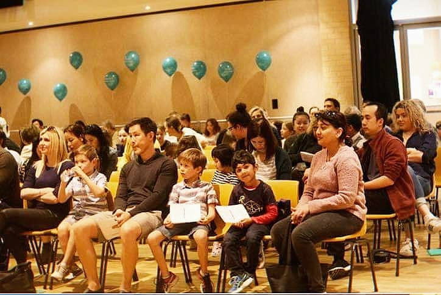

## Why Learn With Us?

* Friendly, personalized learning environment
* All rounded music education
* Half-yearly recitals/ concerts
* 100% Exam Pass Rates 
* Winner of Waverly Brights & Best Local Business Awards 2018

International Schools of Music (ISM) launched in 1997 after extensive research and recognising a need for more contemporary music programs for young students. ISM is now considered a market leader in music education for young students with schools across Australia, New Zealand, Asia, North America and Canada.

Our main aim is to foster a love of music using the piano as the practical instrument, many students have been successful in attaining very high levels of musical achievement. They have awards in music competitions, received scholarships to tertiary institutions, leading them towards a successful career path not only in music, but in various fields.
Our aim is to teach music as a language, with all skills being developed simultaneously. The instruction is aurally based to maximise learning in young students, encouraging not only a love of music, but an understanding of music.

The International School of Music provides beginner to advanced music courses in group and private settings for students from 2 years of age to adults. All our programs cover a wide variety of musical styles and are supported by speed variable backing tracks, carefully structured to maximise the benefit to each student and foster technically and musically all rounded musicians.
