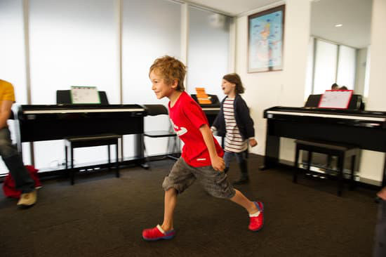

## Comprehensive, contemporary and interactive, group and private music education for all ages.

Our aim is to teach music as a language, with all skills being developed simultaneously. The instruction is aurally based to maximise learning in young students, encouraging not only a love of music, but an understanding of music.

The comprehensive concept of ISM courses is simple: 

**"What you hear, you Sing; What you Sing, you Play; What you Play, you Read; What you Read, you Write."**

## Testimonials

*My two sons have been attending ISM Bondi for a number of years now starting when they they were aged 4. They absolutely love their piano classes and have learnt so much in a short amount of time. They have attended both Group and Private lessons and continue to excel every week. The teachers are caring, encouraging and show pride in their students. I would highly recommend to parents who are looking to place their children into piano classes*

**– Kerrie Dedecke (Parent)**
 

*Our kids have been learning piano with ISM Bondi for over a year. They play games, learn fun songs, play percussion instruments, and learn how to read and write music all while learning to play piano. They love it and I love it so much that I’m now learning to play too!*

**– Linda Hamilton (Parent)**
 

*Professionalism, respect and an outstanding work ethic are the hallmarks of the school and students shine through a combined mix of application, fun and encouragement. The school provides the opportunity, through it’s annual concert, for children to showcase their musical ability from a very early age, as well as instilling confidence in performing to a wider audience.
The school is dedicated to musical education at its best and its skilled and passionate teachers work enthusiastically towards this end with excellent results.*

**– Joan Keogh (Grandparent)**
