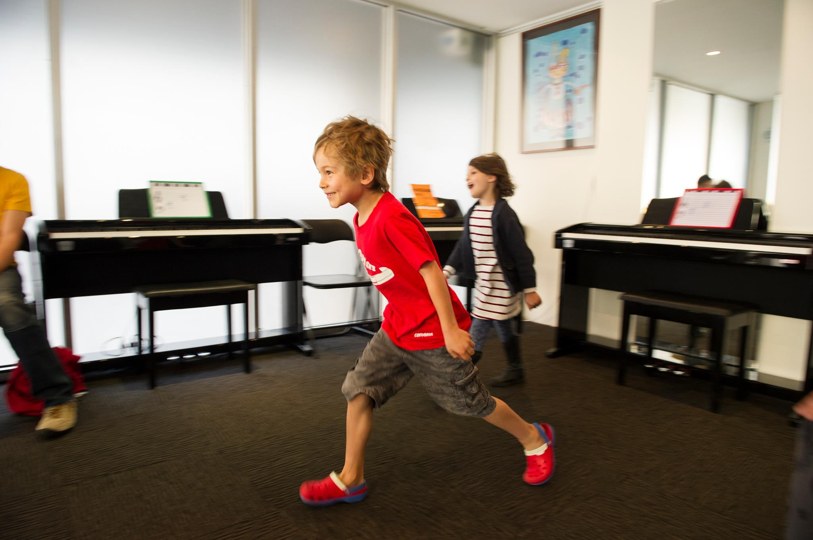

## Pianorama Junior Course  *For 4 – 6 year olds*

Pianorama Junior Music Course comprises all the elements required to develop musical and technical skills for the young beginner. The curriculum is specifically written to encompass a wide range of musical activity, which enables concentration levels to be kept at the optimum during the lesson. A focus on developing a musical ear accelerates the process of achievement. Our classrooms are equipped with a digital piano for each student in the classroom, as well as a full range of percussion instruments. Magnetic music boards for all students simplify theoretical work and all piano pieces are learnt with the additional support of speed variable backing tracks. Our teachers are qualified both musically and in teaching young students.

In each 45 minute weekly lesson, the students experience the following:

Piano tuition – technical development, with solo and ensemble experience;
Aural (Ear) – to train the musical ear for faster comprehension;
Singing – pitch and vocal expression through original, contemporary songs;
Percussion – practical experience of learnt rhythmic patterning;
Theory – intellectual confirmation of music notation and theoretical elements;
Music Appreciation – to develop listening skills and through actions understand musical structure;
Musical Games – Fun activities involving learnt skills

## Pianorama Primary Course

*For students  aged  7 – 12 years – Grouped in age in small classes.*

This course is aimed for students with no previous experience in piano tuition. The focus primarily is to teach the piano as the practical instrument, whilst simultaneously developing strong aural and theoretical skills. Teaching in a group environment for this age is particularly beneficial from the learning perspective, as the students enjoy learning together and aspire to reach standards set by one another. With regular home practice, the students fly through this curriculum and can feel progress from the early stages, which in turn encourages them to continue through to more advanced levels.

The course includes:

Aural – to develop a musical ear both melodically and rhythmically.
Finger Gym  – to develop technically.
Repertoire  – graded pieces covering all musical styles.
Harmony – practical understanding of harmonic processes.
Ensembles – to enjoy playing different parts as a group.
Theory – consolidation theoretically of music and rhythmic notation and additional music elements.
Music Appreciation – to analyse popular musical classics.
Musical Games – to enjoy testing learnt skills through fun activities.
A comprehensive musical education developing not just the technician but also the musician!

