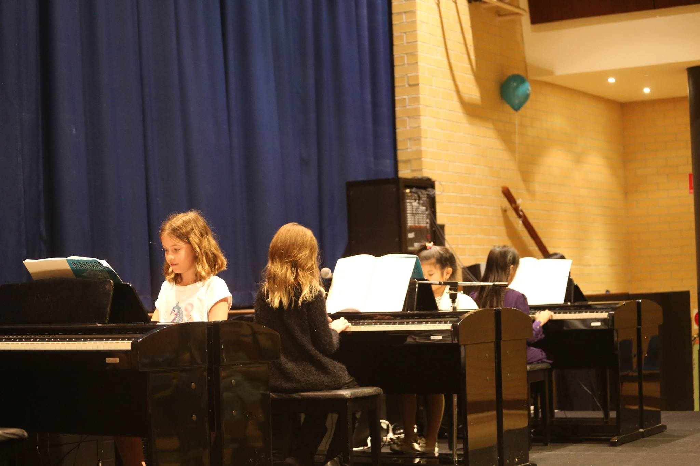

## Early Childhood Music

*For students aged 2-3 years*

This age specific program aims to develop all aspects of early music fundamentals for this most receptive age group. It is at this age that we can open the door for children to learn music as a language.

Segments include:

* Pitch through a structured vocal program of original and known favourites
* Music with movement and physical response
* Creativity
* Gross and fine motor skill exposure
* Rhythmic response using percussion instruments
* Correlation of sounds
* Listening skills through music appreciation
* Elementary notation and rhythmic reading and writing
* Social and verbal interaction, discipline, control, concentration, etc.

## Pianorama Junior Course  

*For students  aged  4 – 6 years – Grouped in small age appropriate classes.*

In each 45 minute weekly lesson, the students experience the following:
* Piano tuition – technical development, with solo and ensemble experience
* Aural (Ear) – to train the musical ear for faster comprehension
* Singing – pitch and vocal expression through original, contemporary songs
* Percussion – practical experience of learnt rhythmic patterning
* Theory – intellectual confirmation of music notation and theoretical elements
* Music Appreciation – to develop listening skills and through actions understand musical structure
* Musical Games – Fun activities involving learnt skills

## Pianorama Primary Course

*For students  aged  7 – 12 years – Grouped in small age appropriate classes.*

The course includes:
* Aural – to develop a musical ear both melodically and rhythmically.
* Finger Gym  – to develop technically.
* Repertoire  – graded pieces covering all musical styles.
* Harmony – practical understanding of harmonic processes.
* Ensembles – to enjoy playing different parts as a group.
* Theory – consolidation theoretically of music and rhythmic notation and additional music elements.
* Music Appreciation – to analyse popular musical classics.
* Musical Games – to enjoy testing learnt skills through fun activities.
* A comprehensive musical education developing not just the technician but also the musician!

## Pianorama Intermediate and Extension Courses

For Junior and Primary Course graduates, to further expand musical and technical skills acquired thus far. All musical styles of repertoire with an expanded technical development program are covered at this level.  This, together with the acquired musical awareness, enables the teacher to work with the students in a broader field including composition, improvisation, keyboard harmony and extended theoretical components. In our Australian schools, many students will present for the AMEB theory exams, having completed the set syllabus for this level in the Extension curriculum. In our international schools, the examination curriculum in each country for specific theoretical levels are also covered in the Extension Course.

