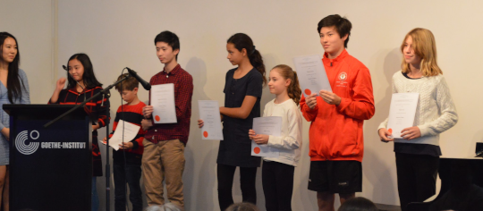

## Instruments offered
* Piano/ Keyboard
* Violin
* Voice
* Guitar
and more...

## Private Lessons 

$85/hr

$65/45mins

$45/30mins

* Personalised one-on-one attention, just teacher and you
* Customised classes to meet your specific needs and goals
* Option to enter examinations and competitions
* Learn at your own pace

## Rotating Private Lessons 

$55/hr

Consists of:
- 30 minutes of one-on-one instrumental tuition.
- 30 minutes of independent work assigned by the teacher ranging from theory, sight reading to composition and aural.

*Great if you have a family member/friend you want to learn with!*

